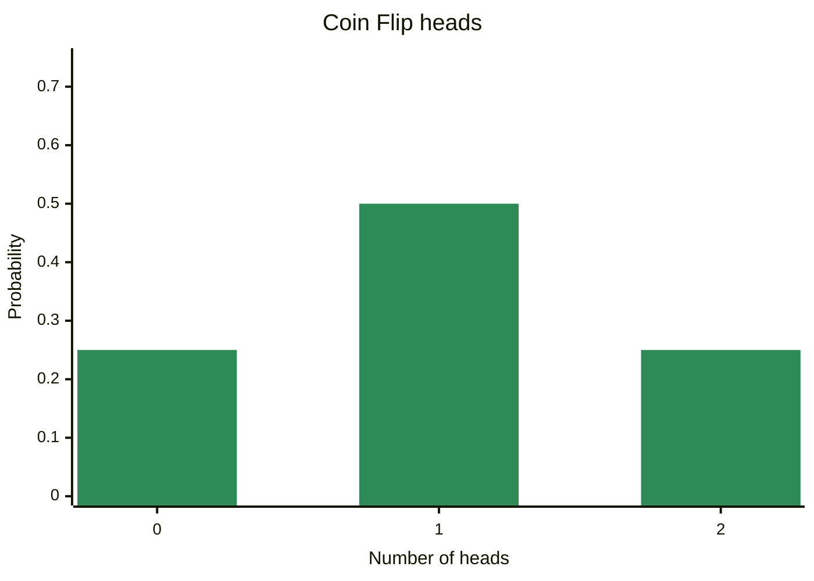

# Discrete Probability Distributions

## discrete probability distribution
- A discrete probability distribution is listing of all the possible outcomes of an experiment for a discrete random variable along with
 the relative frequency of each outcome

## The Mean (Expected Value) of a Discrete Probability Distribution

$$\mu = E(X) = \sum_{i=1}^n x_i * P(x_i)$$

where:   
 - $\mu$ is the mean of the random variable X
 - $x_i$ is the ith outcome of the random variable X
 - $P(x_i)$ is the probability of the ith outcome of the random variable X.

example:

| $x$     | freq | $P(x_i)$ | $P(x_i)*x_i$ |
|--------:|-----:|------:|----------:|
| 2       | 17   | 0,34  | 0,68      |
| 3       | 6    | 0,12  | 0,36      |
| 4       | 16   | 0,32  | 1,28      |
| 5       | 4    | 0,08  | 0,4       |
| 6       | 7    | 0,14  | 0,84      |
| **SUM** | 50   | 1     | 3,56      |

In this case **E(X) = 3,56**

example 2:  
probability of heads in two coin flips

| $x_i$     | $P(x_i)$ | $x_i * P(x_i)$ |
|--------:|-------:|------------:|
| 0       | 0,25   | 0           |
| 1       | 0,5    | 0,5         |
| 2       | 0,25   | 0,5         |
| **SUM** | 1      | 1           |

## The Variance and Standard Deviation of a Discrete Probability Distribution

$$\sigma^2 = Var(X) = \sum_{i=1}^n (x_i - \mu)^2 * p(x_i)$$

$$\sigma = \sqrt{Var(X)}$$

where:   
 - $\sigma^2$ is the variance of the random variable X
 - $\sigma$ is the standard deviation of the random variable X
 - $\mu$ is the mean of the random variable X, 
 - $x_i$ is the ith outcome of the random variable X, 
 - $p(x_i)$ is the probability of the ith outcome of the random variable X.

|size|freq|$p(x_i)$|$p(x_i)*x_i$|$x_i-\mu$|$(x_i-\mu)^2$|$(x_i-\mu)^2*P(x_i)$|
|-|-|-|-|-|-|-|
| 2    | 17   | 0,34  | 0,68      | -1,56  | 2,4336     | 0,827424          |
| 3    | 6    | 0,12  | 0,36      | -0,56  | 0,3136     | 0,037632          |
| 4    | 16   | 0,32  | 1,28      | 0,44   | 0,1936     | 0,061952          |
| 5    | 4    | 0,08  | 0,4       | 1,44   | 2,0736     | 0,165888          |
| 6    | 7    | 0,14  | 0,84      | 2,44   | 5,9536     | 0,833504          |
|      | 50   | 1     | 3,56      |        |            | 1,9264            |

## The Expected Monetary Value

When the discrete random variable is expressed in terms of dollars, the mean of the distribution is known as the expected monetary value (`EMV`). The EMV is commonly used to evaluate the profit potential of projects or the financial return of investment portfolios

$$EMV = \sum_{i=1}^n x_i * P(x_i)$$

where:   
 - $EMV$ is the expected monetary value of the random variable X
 - $x_i$ is the ith outcome of the random variable X
 - $P(x_i)$ is the probability of the ith outcome of the random variable X.

example:

| Complwtion | net_profit | prabability | EMV |
|---|--:|--:|--:|
| before | 120000 | 0,25 | 30000 |
| september | 100000 | 0,6 | 60000 |
| after | 90000 | 0,15 | 13500 |
| __Sum__ |  |  | __103500__ |

*EMV = 103500*

# Binomial Distributions

Binomial distributions have two possible outcomes: success and failure.

## The Binomial Probability Formula

$p$ is the probability of success in a single trial  
$q$ is the probability of failure in a single trial 
$$q = 1 - p$$  
$n$ is the number of trials
$x$ is the number of successes in those $n$ trials

Example:

If our experiment consists of six randomly selected customers, and one of them signs a contract, given that the probability of a customer signing a contract is 0.1, we have the following parameters:

- $p = 0.1$
- $q = 0.9$
- $n = 6$
- $x = 1$

## PMF  
The probability mass function (PMF) is a function that gives the probability that a discrete random variable is exactly equal to some value.

$$ \binom{n}{x} = \frac{n!}{(n-x)!x!} $$  

$$ P(x,n) = \binom{n}{x} p^x q^{n-x}  = \frac{n!}{(n-x)!x!} p^x q^{n-x} $$

where:   
 - $P(x,n)$ is the probability of getting exactly x successes in n trials
 - $n!$ is the factorial of n
 - $x!$ is the factorial of x
 - $p$ is the probability of success in a single trial
 - $q$ is the probability of failure in a single trial
 - $n$ is the number of trials
 - $x$ is the number of successes in those n trials
 - $\binom{n}{x}$ is the number of ways to choose x successes in n trials

Example:
given that the probability of a customer signing a contract is 0.1, we have the following parameters:
n = 6, x = 1, p = 0.1, q = 0.9

$$ P(1,6) = \binom{6}{1} 0.1^1 0.9^{6-1} = \frac{6!}{(6-1)!1!} 0.1^1 0.9^5 = 6 * 0.1^1 0.9^5 = 6 * 0.1 * 0.59 = 0.35 $$

hint:  
$\binom{n}{1} = n$

## The Mean and Standard Deviation of a Binomial Distribution

$$ \mu = n * p $$

$$ \sigma = \sqrt{n  p q} $$

where:   
 - $\mu$ is the mean of the random variable X
 - $\sigma$ is the standard deviation of the random variable X
 - $n$ is the number of trials
 - $p$ is the probability of success in a single trial
 - $q$ is the probability of failure in a single trial

Example:

$$ \mu = 6 * 0.1 = 0.6 $$  

$$ \sigma = \sqrt{6 * 0.1 * 0.9} = \sqrt{0.54} = 0.73 $$
